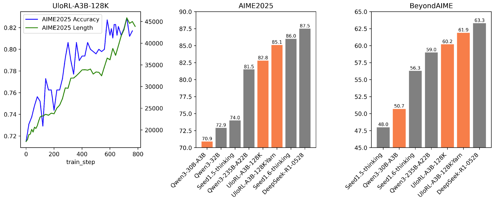

<div align="center">

#  UloRL

<div>
   An <strong>U</strong>ltra-<strong>L</strong>ong <strong>O</strong>utput <strong>R</strong>einforcement <strong>L</strong>earning Approach for Advancing Large Language Models' Reasoning Abilities
</div>
</div>

## Overview

Recent advances in large language models (LLMs) have highlighted the potential of reinforcement learning with verifiable rewards (RLVR) to enhance reasoning capabilities through extended output sequences. However, traditional RL frameworks face inefficiencies when handling ultra-long outputs due to long-tail sequence distributions and entropy collapse during training. To address these challenges, we propose an <strong>U</strong>ltra-<strong>L</strong>ong <strong>O</strong>utput <strong>R</strong>einforcement <strong>L</strong>earning (UloRL) approach for advancing large language models' reasoning abilities. Specifically, we divide ultra long output decoding into short segments, enabling efficient training by mitigating delays caused by long-tail samples. Additionally, we introduce dynamic masking of well-<strong>M</strong>astered <strong>P</strong>ositive <strong>T</strong>okens (MPTs) to prevent entropy collapse. Experimental results demonstrate the effectiveness of our approach. On the Qwen3-30B-A3B model, RL with segment rollout achieved 2.06x increase in training speed, while RL training with 128k-token outputs improves the model's performance on AIME2025 from 70.9\% to 85.1\% and on BeyondAIME from 50.7\% to 61.9\%, even surpassing Qwen3-235B-A22B with remarkable gains.
<div align="center">

</div>

## Releases
**[2025-07-26]**

- **Paper** [paper](https://xxx).
- **Model** Comming Soon
- **Code** Comming Soon

## Acknowledgements
- Our implementation is heaviliy built on [verl](https://github.com/volcengine/verl).
- Our models are trained on top of [Qwen3-4B](https://huggingface.co/Qwen/Qwen3-4B), [Qwen3-8B](https://huggingface.co/Qwen/Qwen3-8B) and [Qwen3-30B-A3B](https://huggingface.co/Qwen/Qwen3-30B-A3B).
  
Thanks for their wonderful work.

## Citation
```bibtex
@misc{Ulorl2025,
    title = {UloRL:An Ultra-Long Output Reinforcement Learning Approach for Advancing Large Language Models' Reasoning Abilities},
    url = {https://xxx},
    author = {Dong Du, Shulin Liu, Tao Yang, Shaohua Chen, Yang Li}
    year = {2025}
}
```
